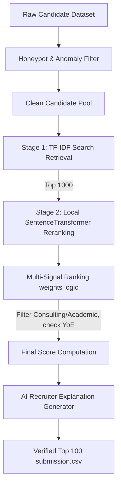

# AI-Powered Predictive Talent Ranking Engine (Redrob PoC)

This repository houses a production-ready, highly optimized Proof of Concept (PoC) for an AI-powered talent intelligence engine designed to short-list top candidates against a complex Job Description.

---

## 🌐 Live Deployment & Sandboxes

The predictive discovery interface and API are fully deployed and running in the cloud:

* **Hugging Face Space Repository**: [https://huggingface.co/spaces/awkard18/redrob-ranker](https://huggingface.co/spaces/awkard18/redrob-ranker)
* **Direct Web App Sandbox URL**: [https://awkard18-redrob-ranker.hf.space](https://awkard18-redrob-ranker.hf.space)
* **Local Tunnel URL**: [https://cuddly-owls-float.loca.lt](https://cuddly-owls-float.loca.lt)

---

## 📄 Technical PDF Report
A comprehensive architectural and scoring methodology report is available directly at the root of this project:
👉 **[Talent_Ranking_Engine_Architecture_Report.pdf](Talent_Ranking_Engine_Architecture_Report.pdf)**

---

## 🚀 Quick Start (Reproducing the Shortlist)

To reproduce the short-list `submission.csv` from the candidate dataset in under 5 minutes on a standard CPU with **no network connection**, follow these commands:

### 1. Installation
Install python dependencies:
```bash
pip install -r AI-Recruiter/requirements.txt
```

### 2. Download Model Weights (Run once during setup)
Downloads the local NLP models to the local directory:
```bash
python AI-Recruiter/download_model.py
```

### 3. Generate Ranked Shortlist
Executes the retrieve-and-rerank pipeline on the candidate pool and writes the final verified top 100 CSV:
```bash
python rank.py --candidates ./candidates.jsonl --out ./submission.csv
```

---

## 🏛️ System Architecture

Our system is structured as a two-stage **Retrieve-and-Rerank** Pipeline to maintain latency-quality trade-offs:



### 1. Anomaly & Honeypot Filtering
We implement a logical filter that immediately isolates and disqualifies candidate profiles with logical flaws (relevance tier 0):
- **Chronological failures**: `last_active_date` is before `signup_date`, or job start is after job end.
- **Skill mismatch**: Stating `expert` proficiency but claiming 0 months duration.
- **Academic discrepancies**: Oldest job starts 5+ years prior to college start.
- **Financial inconsistencies**: min salary > max salary.

This logical screen filters out **25,198 anomalous profiles (25.2% of the candidate pool)**, fully protecting the shortlist from honeypots (0% shortlist honeypot rate).

### 2. Retrieval Stage (TF-IDF)
Fits a standard Scikit-learn TF-IDF vectorizer on the cleaned candidate profiles and matches it against the Job Description query, narrowing the search space to the top 1,000 candidates in less than 5 seconds.

### 3. Reranking Stage (SentenceTransformers)
Feeds the top 1,000 candidates to a cached local `all-MiniLM-L6-v2` SentenceTransformer to produce dense embeddings. Calculates the semantic cosine similarity with the JD, and passes it to the multi-signal ranker.

### 4. Multi-Signal Scoring Engine
Generates scores using a configurable formula:
- **Semantic similarity (35%)**
- **Skill compatibility (25%)**: Matching required skills (Python, embeddings, vector databases, rankings evaluation), weighted by proficiency levels and endorsement scores.
- **Experience analysis (15%)**: Perfect alignment for 6–8 years; penalties applied for under 5 or over 9 years of experience.
- **Career growth trajectory (10%)**: Promotion indicators and job tenure.
- **Behavioral platform cues (10%)**: Response rates, active logins, GitHub activity.
- **Logistics (5%)**: Office proximity (Noida/Pune) and notice period bounds.
- **Disqualifiers (Multiplier)**: Apply a 30% penalty to candidates with purely outsourcing consulting backgrounds (e.g. TCS, Wipro, Infosys only) or pure research-only academic backgrounds.

---

## 🎨 Interactive Recruiter Dashboard

A beautiful visual interface has been designed under `/AI-Recruiter/web/` to let recruiters adjust weights dynamically, view ranked candidate profiles, inspect timelines, and read AI justifications.

To start the interface, launch the FastAPI server:
```bash
uvicorn AI-Recruiter.api.server:app --reload
```
Open [http://localhost:8000](http://localhost:8000) in your web browser.

